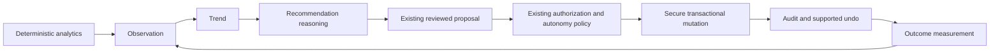

# Brain loop

## What exists today

- `src/domain/analytics/` calculates Epley e1RM, exercise history and
  deterministic progression targets from canonical training sessions.
  `src/lib/progression.ts` retains the old public signatures as a compatibility
  wrapper. `src/domain/analytics.ts` adds stall/volume analysis; hypertrophy,
  readiness, deload, recap and progression rules live in `src/lib/`.
- `buildBrainContext` in `src/ai/progressBrain.ts` builds deterministic summaries from provided workouts (or its optional storage index). The live `/api/forge-brain` route in `server.ts` also drives its own REST-backed tool loop; these are not a single unified observation store.
- The live AI endpoint requires a user-supplied Gemini key through `validateAIAccess`, uses `ToolLoopGuard`, and routes workout recommendations into `createWorkoutProposal` after checking a freshly read workout/version.
- `executeBrainAction` currently validates arguments and returns `ANALYSIS_ONLY`; its old mutation-oriented comments and test log banners are stale. Preserve the read-only implementation. The retired `/api/forge-apply-plan` route responds 410.
- `createWorkoutProposal` records server-derived before/after content, hash, baseVersion and permissionEpoch. `reviewProposal` rechecks ownership, pending status, content, permission epoch/policy and version within the transaction. L0 blocks AI changes; L1 restricts changes; effective L3 is capped to L2 in `permissions`. A preference or model claim cannot raise authority.
- Existing deterministic functions, workout UI and non-AI APIs do not require a
  model key. Phase 2 changes only the internal read path for exercise history
  and progression; it adds no model call, provider or mutation authority.

## Target chain and current limit

`src/domain/canonical/intelligence.ts` introduces only the evidence records needed to describe this chain. Observation references source entities and a metric/unit/value; Trend links observations, window and provenance; Recommendation links evidence and rationale, with an optional existing proposal ID; Decision records accepted/rejected/deferred intent and optional proposal/audit links; Outcome links a decision and measured observations. Insufficient/inconclusive states avoid claiming an effect without evidence.

These schemas reject arbitrary mutation payloads and permission fields. They validate structure, not cross-record ownership, causal attribution, approval or execution. A future service must resolve links under the authenticated user, verify audit/proposal state and choose explicit measurement windows. Accepted recommendations cannot bypass a proposal review. An outcome is not fabricated immediately after a successful write.

No observation/trend producer, recommendation persistence, new decision route,
outcome evaluator, background job, provider or nutrition/social module is
implemented here. Phase 2 only moves exercise-history and progression reads
behind the canonical adapter; it does not build this whole loop. Existing
proposal/audit models remain authoritative and are not renamed to canonical
intelligence types.

## Verification and remaining limitations

Canonical tests exercise schema strictness, numeric/date/range validity, evidence requirements and rejection of authority/payload fields. Existing security/proposal/rollback tests and local emulator tests exercise the real preserved boundaries. Structural domain tests alone cannot prove authorization; follow `../plans/UNIFIED_FITNESS_CORE.md` for the combined evidence.

Canonical history/progression now has explicit completion and identity rules;
the legacy wrapper surfaces adapter diagnostics and keeps old output DTOs.
Other deterministic analytics still have their original legacy semantics. No
end-to-end persistent Observation -> Outcome loop exists yet. Correct this
documentation when that behavior is implemented; do not treat the diagram as a
claim that it already exists.
