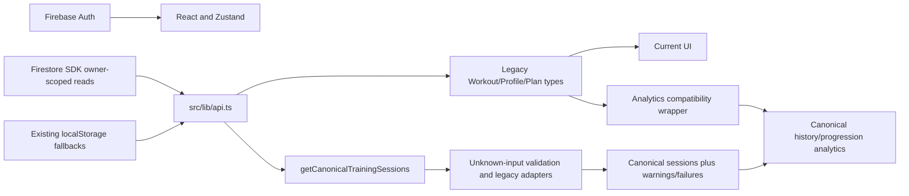
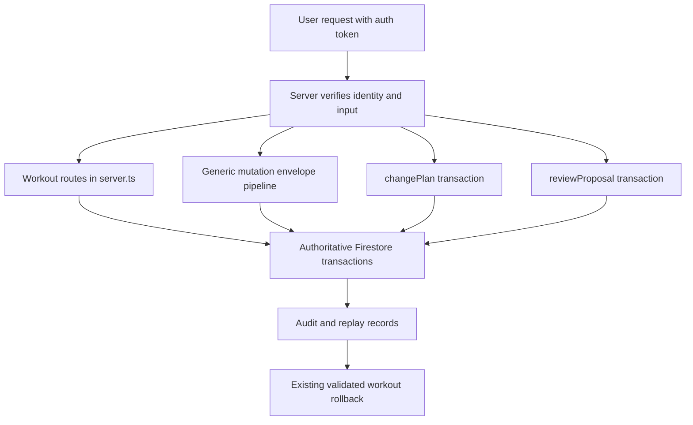

# Data flow

## Existing reads (verified)



`getWorkouts` currently casts SDK/JSON results; the added canonical read parses them without altering that existing API or cache. `useWorkoutStore` manages active flat/nested workouts and identity-bound local state. `acknowledgeWorkout` (`src/lib/workout-sync.ts`) advances acknowledged versions while preserving edits made after dispatch. No new persisted store or cache is introduced.

Server AI read tools use `src/lib/firestore-rest.ts` with the user's token and
userId filters (`src/lib/server-tools.ts`). Their existing public tool payloads
still contain legacy workouts, but `extractExerciseHistory` and
`analyzeExerciseProgression` immediately pass those records through the
read-only compatibility adapter and canonical analytics core. Other analytics
helpers remain on their existing legacy contracts until separately migrated.

## Existing writes (verified, preserved)



Workout create/mutate/delete routes validate owner, transaction state and replay/OCC requirements for their operation, with audit snapshots. The generic pipeline (`src/domain/mutations.ts`) validates envelopes, checks identity/target ownership and replay, and commits through a storage adapter. Route-specific execution performs operation-specific OCC checks; do not assume the generic pipeline provides every operation's version contract.

Plans (`src/server/plans.ts`) use strict input validation, owner checks, baseVersion, transactional replay and audit. Proposals (`src/server/proposals.ts`) validate content hashes, permission epochs, current policy and workout version before committing an approved change. `handleWorkoutRollback` and `executeRollbackValidation` enforce owner/target matching and audit version contiguity; legitimate creation undo deletes only through the existing validated transaction. There is no generic undo guarantee for every future entity.

`firestore.rules` denies direct writes for protected collections and all client access to `mutation_ids`. SDK writes remain permitted under existing owner checks for profiles, threads, bodyweight and record/target collections. Rules are unchanged. Stale comments suggesting client proposal writes are superseded by actual `allow write: if false`.

The Phase 0 emulator check uncovered malformed Firebase tokens returning an accidental 503. `verifyToken` now converts known credential rejection codes into a sanitized 401, as required by the existing HTTP test; infrastructure failures retain their existing handling. No ownership or mutation policy was changed.

## New read contract and future provider path

```text
authorized persisted/legacy read -> adapter -> canonical data + diagnostics
future external provider -> provider adapter -> raw/normalized observation -> canonical model
```

The second path is a design requirement, not an implemented ingestion service. Provider code must decode units/timestamps and retain source identity before schema validation; use existing authorization and secure mutation boundaries for any future writes. Never embed credentials in provenance. New canonical modules import neither Firebase nor model/server SDKs and expose no write adapters. New runtime and paid dependencies: none.

Adopting consumers must handle failures explicitly, and must not convert
canonical projections back into full replacement documents. Continue sending
supported operation payloads to existing APIs with their exact reviewed content
and current OCC version. Removing an opt-in reader rolls back this phase
without data changes. Phase 2 adds no Firestore schema or write path.
